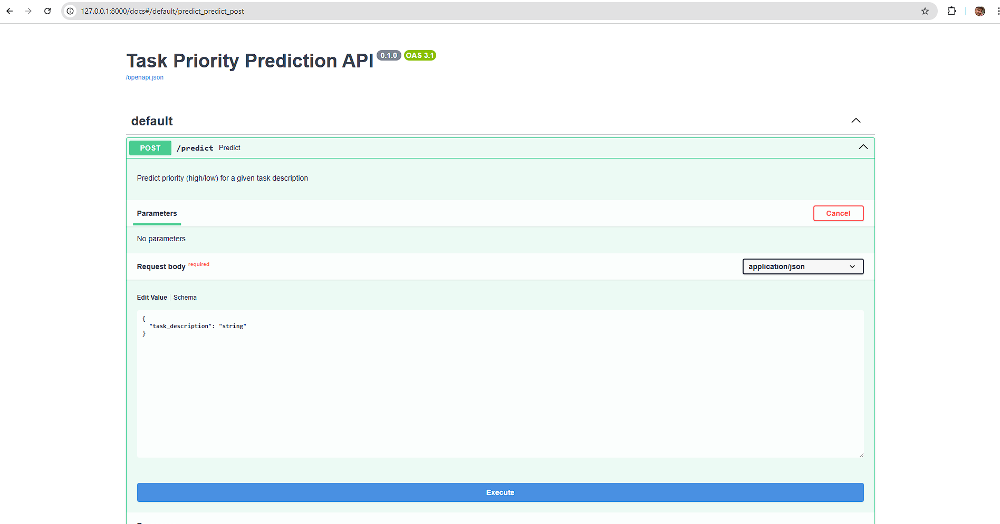
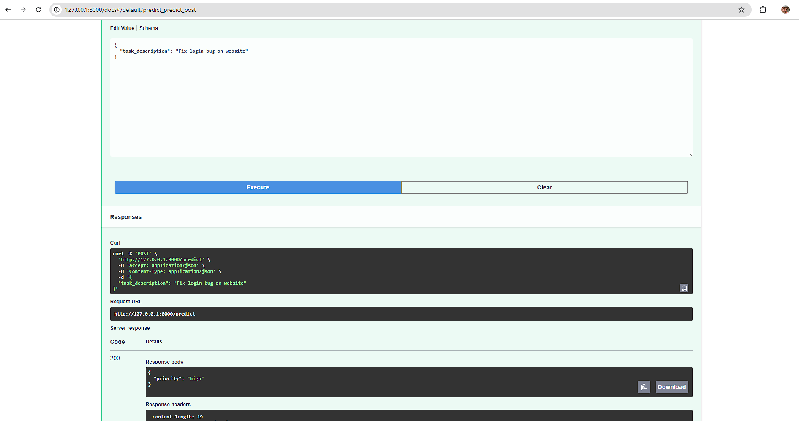

"# ML-integration-FastAPI" 

## Description
FastAPI service that loads a trained ML model and predicts  
task priority (`high` / `low`) based on task description.  

The model (`model.pkl`) and vectorizer (`vectorizer.pkl`) are obtained from 
https://github.com/Anton-Konyk/ML-predict-Priority-Text-Task

Technologies used:
- Python 3.12  
- FastAPI  
- Pydantic  
- scikit-learn  
- joblib 


## ⚙️ Installation

```bash
git clone https://github.com/Anton-Konyk/ML-integration-FastAPI
cd ML-integration-FastAPI
python -m venv .venv
source .venv/bin/activate   # Linux/Mac
.venv\Scripts\activate      # Windows
pip install -r requirements.txt
uvicorn app.main:app --reload
```

*  FastAPI automatically generates interactive API docs:
Swagger UI → http://127.0.0.1:8000/docs
ReDoc → http://127.0.0.1:8000/redoc


## Example
Request:
{
  "task_description": "Fix login bug on website"
}
Response:
{
  "priority": "high"
}

